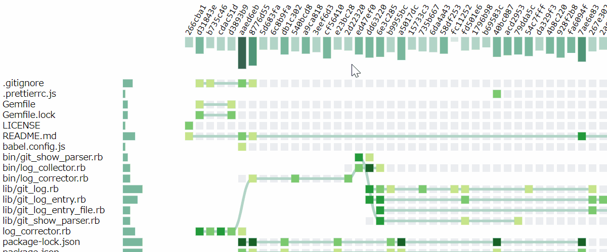

# gh-file-grass

A visualizer of git repository statistics like the 'github grass'.



## Reference

Blog
* [Gitリポジトリのファイル変更履歴を可視化してみる \- Qiita](https://qiita.com/corestate55/items/1642f1fa240b76f6585d)

## Requirements

This repository includes two tools.
* Repository data collector
* Repository data visualizer

The collector is ruby script,
and the visualizer is Node.js application.
So, a environment which works ruby and Node.js work is required.

Development of these tools are on environments below:
* [Node.js](https://nodejs.org/)\/10.15, [npm](https://www.npmjs.com/)\/6.13
  * [Vue CLI3](https://cli.vuejs.org/)
  * [D3.js](https://d3js.org/)
* [Ruby](https://www.ruby-lang.org/)\/2.6.4
  * [ruby-git](https://github.com/ruby-git/ruby-git)

## Project setup

### Setup collector

Install gems.
```
bundle install --path=vendor/bundle
```

### Setup visualizer

Install npm packages.
```
npm install
```

### Generate repository data

Run the collector to generate repository data and save the output as name `public/logs.json`,
because the file name of repository data is hard-corded in visualizer (currently).
```
bundle exec ruby ./bin/log_collector.rb -r /path/to/repository > ./public/logs.json
```

Options:
* `-n COUNT`: number of logs
* `-p`: pretty-print

### Run visualizer

Run visualizer with HTTP server. (`localhost:8000` in default.)
```
npm run serve
```

## Notes for visualizer

### Compiles and hot-reloads for development
```
npm run serve
```

### Compiles and hot-reloads for development
```
npm run serve
```

### Compiles and minifies for production
```
npm run build
```

### Lints and fixes files
```
npm run lint
```

### Customize configuration
See [Configuration Reference](https://cli.vuejs.org/config/).
